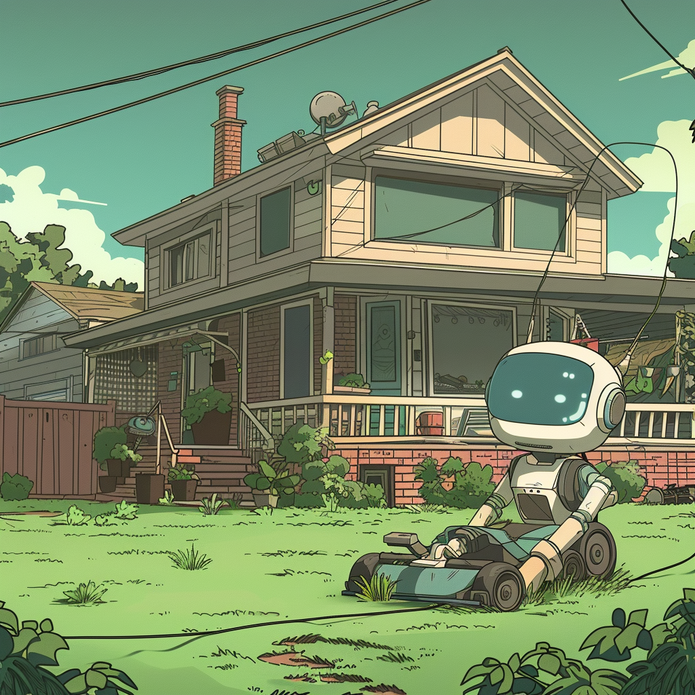

# Mowee: The Lawn Mower Robot

Tired of constantly having to mow the lawns of his various properties, John decides to improve his programmable lawn mower such that it runs by itself on demand and mows the entire lawn without being blocked by the various obstacles on its way.

## Part I: Design

Design a hierarchy of classes following OOP principles such that:
- A rectangular lawn of any dimensions may be represented
- Obstacles may be placed within the lawn's map
- The robot may be placed and move within the lawn's boundaries

Rules:
- The robot may only move left/right/up/down, diagonals are not supported
- The robot cannot move where an obstacle exists

Write tests ensuring that the core rules can't be broken.

## Part II: Automation

Eventually creating a specific example out of your previous design, create and test an algorithm that makes Mowee mow the whole lawn automatically.

